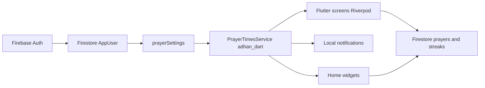
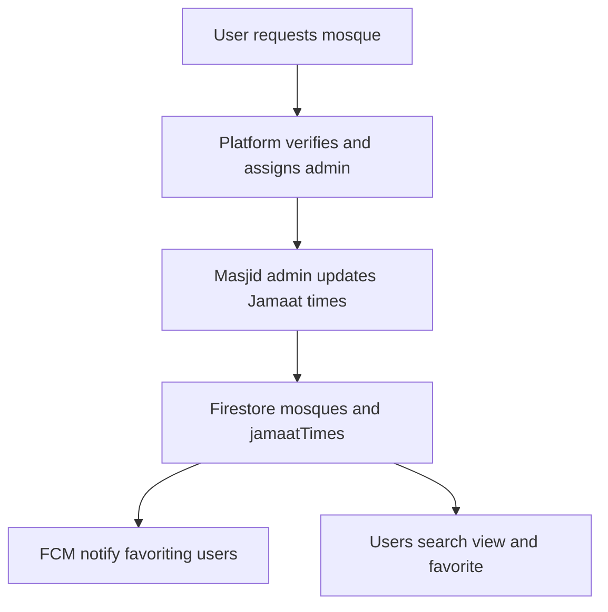

# Jaiza — Project Overview & Jamaat Timing Feature

**Product:** Jaiza (Jaiza-Namaz)  
**Organization:** Al Islaah Academy  
**Platform:** Flutter (iOS, Android, web, desktop targets)  
**Backend:** Firebase (Authentication + Cloud Firestore; push via Firebase Cloud Messaging planned for Jamaat alerts)  
**Document type:** Project report — current product, architecture, improvements, and proposed Mosque Jamaat Timing feature

---

## Table of contents

1. [Project overview](#1-project-overview)
2. [How the app works today](#2-how-the-app-works-today)
3. [Architecture](#3-architecture)
4. [Firestore data model (current)](#4-firestore-data-model-current)
5. [Limitations and improvement recommendations](#5-limitations-and-improvement-recommendations)
6. [Proposed feature: Mosque Jamaat Timing](#6-proposed-feature-mosque-jamaat-timing)
7. [Implementation roadmap](#7-implementation-roadmap)
8. [Glossary](#8-glossary)

---

## 1. Project overview

### 1.1 Purpose

**Jaiza** helps Muslims track worship in a structured, encouraging way. Users mark obligatory prayers (**Fard**), optional prayers (**Nawafil**), and makeup prayers (**Qaza**). The app shows location-based prayer windows, schedules gentle local reminders, keeps a history of marks, and supports home-screen widgets for quick marking.

Beyond personal tracking, Jaiza supports family and institutional use:

| Role | Purpose |
|------|---------|
| **Individual** | Personal Fard / Nawafil / Qaza tracking, reminders, history, profile |
| **Parent** | Manage phoneless children and mark their daily Fard on their behalf |
| **Organization** | Madrasa / school: org admin invites teachers; teachers manage classes and students and mark attendance |

### 1.2 Product idea in one sentence

Jaiza is a Firebase-backed prayer accountability app: calculated **azan / namaz windows** for reminders and tracking, with multi-role attendance for parents and organizations — and (proposed) mosque-published **Jamaat (iqamah) times** for congregation coordination.

### 1.3 What Jaiza is not (today)

- It does **not** fetch namaz times from a remote prayer API; times are computed on-device with `adhan_dart`.
- It has **no** mosque directory, nearby masjid finder, or Jamaat/iqamah editing (mosque UI is decorative only).
- It does **not** use Firebase Cloud Messaging (FCM); reminders are **local notifications** only.
- Contact and Donation screens are informational / placeholder, not fully wired integrations.

### 1.4 Tech stack summary

| Layer | Choice |
|-------|--------|
| UI framework | Flutter |
| State | Riverpod (`flutter_riverpod`) |
| Navigation | `go_router` |
| Auth | Firebase Auth (email / password + email verification) |
| Database | Cloud Firestore |
| Prayer calculation | `adhan_dart` |
| Location | `geolocator` + `geocoding` |
| Local reminders | `flutter_local_notifications` + `timezone` |
| Home widgets | `home_widget` (Android + iOS setup) |

---

## 2. How the app works today

### 2.1 User journey (auth and roles)

1. **Splash** — animated entry; routes based on auth and onboarding.
2. **Onboarding** — first-launch pages (flag stored in `SharedPreferences`).
3. **Welcome → Get started / Login / Signup** — email and password via Firebase Auth.
4. **Email verification** — unverified users are blocked at `/verify-email`.
5. **Role selection** — Individual, Parent, or Organization (`users/{uid}.role`).
6. **Role home:**
   - Individual → `/app/home`
   - Parent → `/app/parent`
   - Organization admin → `/app/org/admin`
   - Organization teacher → `/app/org/teacher`

Router redirects re-run on auth changes (`GoRouterRefreshStream`). Deep links such as `jaiza://prayer/mark?...` support home-widget quick mark.

### 2.2 Namaz (azan) times — calculated, not mosque-set

Prayer **start / end windows** are computed locally:

- Inputs: GPS or manual coordinates, calculation method (e.g. Karachi, MWL, ISNA), madhab (Hanafi / Shafi for Asr).
- Output: daily schedule for Fajr, Zuhr, Asr, Maghrib, Isha (and derived Nawafil windows for UI).
- Default location when GPS is off: Mecca coordinates.

These are **azan / window times**. They are **not** Jamaat (iqamah) times. The proposed feature (Section 6) adds mosque-published Jamaat times without replacing this calculation.

### 2.3 Prayer logging and streaks

- Users mark prayers as **completed** or **missed**.
- Logs live in `prayers/{id}` with a deterministic ID:  
  `{userId}_{localDateKey}_{prayerName}_{type}`.
- Parents / teachers may log on behalf of a child or student using `ownerUid`.
- Streaks / badges are stored in `streaks/{userId}` (streak UI on the home hub was reduced by product decision; computation remains).

### 2.4 Notifications (current)

- **Local only:** channel `jaiza_prayer_end`.
- Schedules start-of-window and ~10 minutes before end for Fard (rolling ~3 days).
- Cancels end reminder when a prayer is marked completed.
- Driven from settings / home-widget sync paths.
- Qaza frequency preferences can be stored, but **Qaza reminder scheduling is not fully implemented** yet.

### 2.5 Main Individual features

| Area | Behavior |
|------|----------|
| Home hub | Current prayer status + tiles (Fard, Nawafil, Qaza, Fazail, About, Contact, Donation) |
| Fard | Mark today’s five obligatory prayers |
| Nawafil | Optional prayers when enabled on profile |
| Qaza | Backlog setup wizard + makeup dashboard |
| History | Calendar / history of logs |
| Reminders | Read-only view of today’s reminder schedule |
| Widgets & notifications | Calc method, location, notification toggles |
| Profile | Profile fields, settings, change password |
| About / Academy / Benefits | Static content (including Urdu academy intro) |

Parent and Organization flows manage children / classes / students and reuse prayer logging patterns under those entities.

---

## 3. Architecture

### 3.1 High-level flow



### 3.2 Code organization

```
lib/
  main.dart, app.dart, firebase_options.dart
  providers/          # Riverpod wiring
  router/             # go_router + auth redirects
  services/           # prayer times, location, notifications
  data/models/        # AppUser, PrayerLog, org models, …
  data/repositories/  # Auth, User, Prayer, Streak, Children, Organization
  features/           # feature-first presentation (auth, home, fard, …)
  core/               # theme, widgets, l10n, utils
```

### 3.3 State management pattern

- `Provider` — Firebase instances and repositories  
- `StreamProvider` — Auth, `AppUser`, prayers, streaks, children, org streams  
- `FutureProvider` — computed current prayer card  
- `StateProvider` — UI selection (selected child / class)  
- UI mostly `ConsumerWidget` / `ConsumerStatefulWidget`

---

## 4. Firestore data model (current)

Firebase project id: **`jaiza-namaz`**.

### 4.1 Collections

#### `users/{uid}`

Profile and preferences: `uid`, `name`, `email`, optional `age` / `city` / `phone`, timestamps, `nawafilEnabled`, nested `prayerSettings`, nested `qazaPlan`, `role`, optional `orgId` / `orgMemberRole`.

Subcollection: `users/{uid}/children/{childId}` for Parent role.

#### `prayers/{id}`

`userId`, `prayerName`, `type` (`fard` | `nawafil` | `qaza`), `status` (`completed` | `missed`), `dateTime`, optional `ownerUid`.

#### `streaks/{userId}`

`currentStreak`, `longestStreak`, `lastFardPerfectDate`, `badgesUnlocked`.

#### `organizations/{orgId}`

`name`, `adminUid`, timestamps.

Subcollections: `invites`, `teachers`, `classes`, `classes/{id}/students`.

### 4.2 Security notes (current)

- Users can read/write their own user doc and children.
- Prayer create/read/update/delete scoped to owner or org admin helpers.
- **Streaks** are readable/writable by any signed-in user (weaker than prayers — candidate for tightening).
- Org invites and class data are scoped to admins, invitees, and teachers as defined in `firestore.rules`.

---

## 5. Limitations and improvement recommendations

Recommendations below are grounded in the current codebase and product gaps.

### 5.1 Product and documentation

| Issue | Recommendation |
|-------|----------------|
| README was still the Flutter template | Maintain a clear product README + this overview doc |
| Contact is informational only | Wire mailto / deep links or a simple Firestore-backed contact form |
| Donation is a placeholder | Link a real donation URL or payment flow when ready |
| Coming-soon / unfinished Qaza reminders | Finish scheduling Qaza frequency reminders or hide the promise until ready |

### 5.2 Notifications and reliability

| Issue | Recommendation |
|-------|----------------|
| Local notifications only | Add **FCM** for cross-device and server-triggered alerts (required for Jamaat change notifications) |
| `android_alarm_manager_plus` unused | Either use it for reliable Android scheduling or remove the dependency |
| Qaza reminder prefs unused | Implement scheduling or remove UI that implies it works |

### 5.3 Security and correctness

| Issue | Recommendation |
|-------|----------------|
| Broad streak write rules | Restrict streak writes to the owning uid / parent / teacher patterns |
| Splash always routes verified users toward individual home in some paths | Align splash with `homeRouteForAppUser` for Parent / Org |
| Missing iOS `GoogleService-Info.plist` in repo (while options exist) | Ensure iOS Firebase config is present for all contributors |

### 5.4 UX and engagement

| Issue | Recommendation |
|-------|----------------|
| Streak / badge computation without strong home surface | Restore a lightweight streak card or place badges on Profile / History |
| No mosque discovery | Implement Mosque Jamaat Timing (Section 6) — search, favorites, admin-published iqamah |
| Localization | Expand beyond English + partial Urdu (`AppStrings` notes future ARB) |

### 5.5 Logic improvements (prayer tracking)

- Keep azan calculation local for offline reliability; optionally show “source: calculated” vs “source: mosque Jamaat” side by side after the new feature ships.
- Consider clearer separation in UI copy: **Prayer window** vs **Jamaat time** so users never confuse the two.
- For Parent / Org, ensure notification and widget behavior remains individual-scoped unless explicitly designed otherwise.

---

## 6. Proposed feature: Mosque Jamaat Timing

### 6.1 Problem statement

Muslims need to know when the **congregation (Jamaat)** starts at a specific mosque. Azan / calculated namaz times tell when a prayer window begins; **Jamaat (iqamah) time** is decided by each mosque and can change (e.g. seasonal schedules, Ramadan, temporary adjustments).

Today Jaiza only computes azan windows. It cannot:

- List or search mosques in a shared database  
- Let a mosque representative publish Jamaat times  
- Notify followers when those times change  

### 6.2 Goals

1. Allow users to **add / request** mosques near home or anywhere (Pakistan or worldwide).
2. After **platform (Al Islaah) verification**, assign a **masjid admin** who alone can edit **Jamaat times** (not calculated namaz/azan times).
3. Let any user **search** approved mosques and **view** their Jamaat times.
4. Let users **favorite** mosques; favoriting users receive a **notification** when any Jamaat time for that mosque changes.
5. Keep the **backend entirely on Firebase** (Auth, Firestore, Security Rules, and FCM + Cloud Functions for change alerts).

### 6.3 Non-goals

- Masjid admin does **not** change app-wide calculated namaz / azan times.
- Jamaat feature does **not** replace Fard / Nawafil / Qaza tracking.
- Platform does not need to become a full maps product in v1 (search + city filters + optional nearby sort is enough).
- Organization (madrasa) role is separate from masjid admin (different domain).

### 6.4 Key distinction

| Term | Meaning in Jaiza |
|------|------------------|
| **Namaz / Azan time** | Start of the prayer window from `adhan_dart` (user location + method) |
| **Jamaat / Iqamah time** | Congregation start time published by a verified mosque admin |

### 6.5 Actors and permissions

| Actor | Can do |
|-------|--------|
| **Any signed-in user** | Request/add a mosque (pending); search approved mosques; view Jamaat times; favorite / unfavorite |
| **Mosque requester** | Submit mosque details; optionally nominate themselves as admin (pending approval) |
| **Platform / Al Islaah reviewer** | Approve or reject mosque; assign or confirm `adminUid` |
| **Masjid admin** (verified) | Update Jamaat times for their mosque only |
| **Favoriting namazi** | Receive FCM when Jamaat times change |

### 6.6 Lifecycle



**Steps in detail:**

1. **Request** — User submits name, address, city, country, optional coordinates, optional phone, optional “I am the admin” claim with contact proof notes.
2. **Pending** — Document stored with `status: pending`. Not searchable in the public approved list (or shown as pending only to requester / platform).
3. **Platform review** — Al Islaah reviewer verifies legitimacy (manual process in v1: in-app queue and/or Firebase Console). On approve: `status: approved`, set `adminUid`. On reject: `status: rejected` with optional reason.
4. **Admin edits Jamaat** — Admin sets times for Fajr, Zuhr, Asr, Maghrib, Isha (and optional Jumuah). Edits write to Firestore with `updatedAt` / `updatedBy`.
5. **Discovery** — Users search by name / city; open mosque detail; see Jamaat timetable; toggle favorite.
6. **Notify** — Cloud Function on Jamaat time update loads users who favorited that mosque and sends FCM (“Jamaat time updated at {Mosque Name}”).

### 6.7 Proposed Firestore schema

Backend remains Firebase. Suggested collections:

#### `mosques/{mosqueId}`

| Field | Type | Notes |
|-------|------|-------|
| `name` | string | Display name |
| `nameLower` | string | For search / prefix queries |
| `address` | string | Street / area |
| `city` | string | |
| `country` | string | e.g. Pakistan |
| `lat`, `lng` | number | Optional but recommended for nearby |
| `status` | string | `pending` \| `approved` \| `rejected` |
| `requestedByUid` | string | Creator |
| `adminUid` | string \| null | Set on approval |
| `adminClaimRequested` | bool | Requester asked to be admin |
| `rejectionReason` | string \| null | Optional |
| `createdAt`, `updatedAt` | timestamp | |
| `approvedAt` | timestamp \| null | |
| `approvedByUid` | string \| null | Platform reviewer |

#### `mosques/{mosqueId}/jamaatTimes/current`

Single document for the live timetable (simple for listeners and security):

| Field | Type | Notes |
|-------|------|-------|
| `fajr` | string | e.g. `"05:15"` local mosque clock time (document timezone below) |
| `zuhr` | string | |
| `asr` | string | |
| `maghrib` | string | |
| `isha` | string | |
| `jumuah` | string \| null | Optional Friday Jamaat |
| `timezone` | string | IANA tz, e.g. `Asia/Karachi` |
| `notes` | string \| null | e.g. “Ramadan schedule” |
| `updatedAt` | timestamp | |
| `updatedBy` | string | Admin uid |

Optional later: `mosques/{mosqueId}/jamaatTimesHistory/{id}` for audit trail.

#### `users/{uid}` extensions

| Field | Type | Notes |
|-------|------|-------|
| `favoriteMosqueIds` | array\<string\> | Mosque IDs the user follows |
| `fcmTokens` | array\<string\> or map | Device tokens for FCM |
| `isMasjidAdmin` | bool | Denormalized convenience (optional; source of truth is `mosques.adminUid`) |

#### `platformAdmins/{uid}`

| Field | Type | Notes |
|-------|------|-------|
| `uid` | string | Same as doc id |
| `createdAt` | timestamp | |

Presence of this document grants platform review permissions in Security Rules (and optionally Custom Claims for stronger enforcement).

### 6.8 Security Rules outline

- **Read approved mosques:** any authenticated user (or public read if product requires guest browse).
- **Create mosque request:** authenticated; force `status == pending`, `requestedByUid == auth.uid`, `adminUid` unset or ignored until platform sets it.
- **Update status / adminUid:** only if `exists(/platformAdmins/$(auth.uid))` (or custom claim `platformAdmin == true`).
- **Write `jamaatTimes/current`:** only if `get(mosque).adminUid == auth.uid` and `status == approved`.
- **Favorites / FCM tokens:** user may update only their own `users/{uid}` fields for favorites and tokens.
- **Reject client-side spoofing** of `status` transitions from pending → approved by non-platform users.

### 6.9 App surfaces (Flutter)

| Screen / area | Responsibility |
|---------------|----------------|
| **Mosques / Discover** | Search field, city filter, list of approved mosques; entry on Home hub |
| **Mosque detail** | Name, address, Jamaat timetable; optional side-by-side “calculated azan for your location” for clarity; Favorite button |
| **Request mosque** | Form to add a mosque to the database (pending) |
| **My favorites** | List of favorited mosques with quick access to times |
| **Masjid admin panel** | Visible only if `adminUid == currentUser`; edit Jamaat times only |
| **Platform review queue** | List pending mosques; approve/reject; assign admin (restricted to platform admins) |
| **Notifications settings** | Toggle Jamaat change alerts (requires FCM permission) |

### 6.10 Notification behavior

- **Trigger:** any write to `jamaatTimes/current` that changes one or more prayer fields.
- **Audience:** users whose `favoriteMosqueIds` contains that `mosqueId`.
- **Channel:** FCM (Firebase); optionally also show in-app banner when app is open.
- **Copy example:** “Jamaat times updated at Masjid Al-Noor — Fajr is now 05:20.”
- **Not the same as** local azan window reminders; both can coexist.

Implementation sketch (still Firebase):

1. Client writes new Jamaat times (admin only).  
2. Cloud Function `onWrite` on `mosques/{id}/jamaatTimes/current`.  
3. Query users with that mosque in favorites (or maintain reverse index `mosqueFavorites/{mosqueId}/users/{uid}` for scale).  
4. Send multicast FCM using stored tokens.

For scale, prefer a reverse index:

#### `mosqueFavorites/{mosqueId}/subscribers/{uid}`

Created/deleted when a user favorites/unfavorites — makes notify fan-out efficient.

### 6.11 Search behavior

- Primary: text search on `nameLower` / city (Firestore prefix queries or a simple client filter for v1; Algolia/Extensions later if catalog grows large).
- Secondary: “near me” sort by distance when lat/lng present (client-side haversine over a city-scoped result set is acceptable for v1).
- Only **`approved`** mosques appear in public search.

### 6.12 Relation to existing roles

- **Individual / Parent / Organization** users can all favorite and view mosques.
- **Masjid admin** is an *additional capability* tied to `mosques.adminUid`, not a replacement for `UserRole`.
- A user might be Individual + masjid admin for one mosque.
- Platform admin is orthogonal (Al Islaah staff), stored in `platformAdmins`.

### 6.13 UX copy guidance

Always label times clearly:

- “Prayer window (calculated)” — from `PrayerTimesService`  
- “Jamaat time (mosque)” — from Firestore  

Never imply that editing Jamaat changes the user’s calculated namaz schedule.

---

## 7. Implementation roadmap

Phased plan for building the feature later (this document does not implement it):

| Phase | Work |
|-------|------|
| **1. Data foundation** | Add `mosques`, `jamaatTimes`, `platformAdmins`, favorites fields; deploy Security Rules and indexes |
| **2. Push infrastructure** | Add `firebase_messaging`, token storage, Cloud Function skeleton for Jamaat change notify |
| **3. User discovery** | Flutter module: search, detail, request mosque, favorites |
| **4. Admin editing** | Masjid admin panel; validate times; write `jamaatTimes/current` |
| **5. Platform ops** | Review queue UI (or documented Console workflow + minimal in-app tools) |
| **6. Notifications** | Wire Function → FCM; settings toggle; deep link to mosque detail |
| **7. Polish** | Nearby sort, Jumuah, history of changes, duplicate-mosque detection, Urdu strings |

Suggested feature folder: `lib/features/mosques/` with models, repository, and presentation screens consistent with existing Riverpod + go_router patterns.

---

## 8. Glossary

| Term | Definition |
|------|------------|
| **Namaz / Salah** | The Islamic prayer |
| **Fard** | Obligatory prayer |
| **Nawafil** | Optional / voluntary prayers |
| **Qaza** | Makeup for missed obligatory prayers |
| **Azan / Adhan** | Call to prayer; in Jaiza, “azan time” means the calculated start of the prayer window |
| **Jamaat** | Congregational prayer at a mosque |
| **Iqamah** | Call / moment when Jamaat starts; **Jamaat time** in this document |
| **Masjid admin** | Verified user allowed to publish Jamaat times for a specific mosque |
| **Platform admin** | Al Islaah / Jaiza staff who approve mosques and assign masjid admins |
| **Favorite mosque** | Mosque a user follows for Jamaat viewing and change notifications |

---

## Appendix A — Current vs proposed (summary)

| Capability | Today | After Jamaat feature |
|------------|-------|----------------------|
| Azan / window times | Local `adhan_dart` | Unchanged |
| Prayer tracking | Firestore logs | Unchanged |
| Local prayer reminders | Yes | Unchanged (still local) |
| Mosque directory | No | Yes (Firebase) |
| Jamaat times | No | Yes (admin-published) |
| Mosque search | No | Yes |
| Favorites | No | Yes |
| Alert when Jamaat changes | No | Yes (FCM + Cloud Functions) |
| Backend | Firebase Auth + Firestore | Same + FCM + Functions |

---

## Appendix B — Success criteria

The feature is successful when:

1. A user can request a mosque and see it pending.  
2. A platform admin can approve it and assign a masjid admin.  
3. Only that admin can change Jamaat times.  
4. Any signed-in user can search approved mosques and view Jamaat times.  
5. Favoriting users receive a notification when those times change.  
6. Calculated namaz tracking and reminders continue to work independently.

---

*End of document. For setup notes on home widgets, see [`WIDGET_SETUP.md`](../WIDGET_SETUP.md).*
