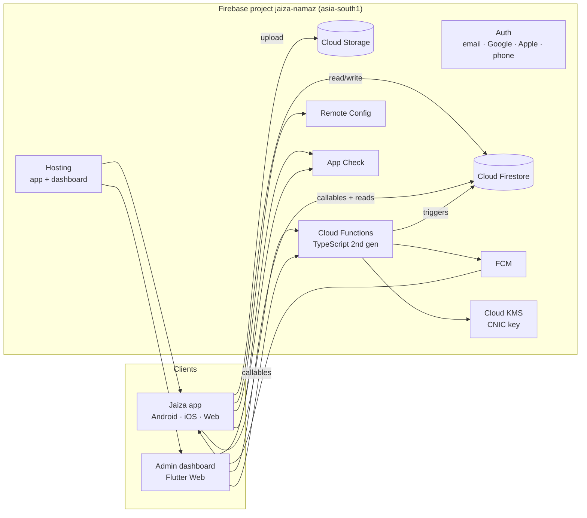

# 03 — Architecture

## 1. The big picture



**Rules of thumb**

- Client apps **read directly** from Firestore (real-time streams, offline cache).
- Client apps **write directly** only to data the user owns: their profile, their prayer logs, their
  children's logs, their class marks, their mosque timetable. Rules check every write.
- Anything that **grants access, touches another person's data, needs a secret, or must not be faked**
  goes through a **Callable Function**. Examples: claiming invites, redeeming codes, submitting CNIC,
  approving mosques, deleting accounts.
- Anything that must **react** to data (streaks, counters, notifications) is a **Firestore trigger**.

## 2. Repository layout (monorepo, D-008)

```
Jaiza-Namaz/
├── pubspec.yaml               # workspace root + the Jaiza app itself
├── lib/                       # Jaiza app (Android/iOS/Web)
├── test/  integration_test/
├── android/ ios/ web/
├── assets/
├── l10n.yaml                  # gen-l10n config (16)
├── packages/
│   └── jaiza_core/            # pure Dart: models, enums, schedule math, validators
│       ├── lib/src/models/    # freezed models shared by app + dashboard
│       ├── lib/src/logic/     # jamaat schedule resolver, dateKey, streak math (mirrors functions)
│       └── test/
├── admin_dashboard/           # Flutter web app for Al Islaah staff (14)
│   ├── lib/
│   └── web/
├── functions/                 # Cloud Functions, TypeScript (08)
│   ├── src/
│   ├── scripts/               # one-off admin scripts (set claims, migrations, seed)
│   └── test/
├── firebase.json  .firebaserc
├── firestore.rules  firestore.indexes.json  storage.rules
├── remoteconfig.template.json
└── docs/system-design/
```

**Pub workspaces** (Dart ≥ 3.6; the project uses `sdk: ^3.11.0`, so this is fine):

```yaml
# root pubspec.yaml
name: jaiza_namaz
environment:
  sdk: ^3.11.0
workspace:
  - packages/jaiza_core
  - admin_dashboard
dependencies:
  jaiza_core: any        # resolved from the workspace
```
```yaml
# packages/jaiza_core/pubspec.yaml and admin_dashboard/pubspec.yaml
resolution: workspace
```
Then one `flutter pub get` at the root resolves everything with one lockfile.

**`jaiza_core` rule:** it **MUST NOT** import Flutter or any Firebase package. Models convert `Timestamp`/`GeoPoint` through
converters that live in the app/dashboard (`lib/core/firestore/converters.dart`), so `jaiza_core`
stays pure Dart and is testable with `dart test`. Where a model needs a date, it uses `DateTime`, and
the converter maps it.

> Simpler alternative if pure-Dart is too strict at first: allow `cloud_firestore` as a dependency of
> `jaiza_core` (it works on both the app and the Flutter web dashboard). Pick one on day 1 and record
> it as D-0xx. **Recommended: pure Dart.**

## 3. App layers

```
presentation  →  (controllers: Notifiers)  →  data (repositories)  →  Firebase SDKs
      ↘                                ↘
        domain (models, pure logic) ←———  used by all layers
```

| Layer | Contains | May import | MUST NOT import |
|-------|----------|-----------|-----------------|
| `domain/` | freezed models (or re-exports from `jaiza_core`), enums, pure functions (e.g. `effectiveJamaatFor(date)`), repository **interfaces** (abstract classes) | `jaiza_core`, `dart:*`, `freezed_annotation`, `meta` | Flutter widgets, Firebase, Riverpod |
| `data/` | Repository implementations, Firestore/Storage/Functions sources, DTO mapping, repository providers | domain, Firebase SDKs, `riverpod` | presentation |
| `presentation/` | Screens, widgets, `controllers/` (Notifiers that hold screen state and call repositories) | domain, data (providers only), core | Firebase SDKs directly |

- A widget **never** calls `FirebaseFirestore.instance` (today `app_router.dart` reads
  `FirebaseAuth.instance.currentUser` directly — move that to a provider).
- Every repository has an interface in `domain/` and one Firestore implementation in `data/`. Tests
  override the provider with a fake.

## 4. Folder structure (D-082)

```
lib/
├── main.dart                        # bootstrap only (see §6)
├── app.dart                         # MaterialApp.router, theme, locale, l10n delegates
├── bootstrap/
│   ├── firebase_bootstrap.dart      # initializeApp, App Check, emulators, persistence
│   ├── crash_reporting.dart
│   └── env.dart                     # const bool useEmulators = bool.fromEnvironment('USE_EMULATORS')
├── core/                            # shared, feature-agnostic
│   ├── theme/  l10n/ (generated)  layout/  widgets/  animations/
│   ├── firestore/                   # converters, paths (FsPaths), batch helpers
│   ├── errors/                      # AppException, ErrorMapper
│   ├── logging/  analytics/
│   ├── local/                       # SharedPreferences wrappers (device-only prefs)
│   ├── connectivity/
│   └── utils/                       # dateKey, formatting
├── router/
│   ├── app_router.dart              # routes
│   ├── redirect.dart                # pure redirect function (unit-tested)
│   └── routes.dart                  # path constants
├── services/                        # platform services, no business rules
│   ├── prayer_times_service.dart    # adhan_dart wrapper
│   ├── location_service.dart
│   ├── local_notifications_service.dart
│   ├── push_service.dart            # FCM token + topics
│   ├── notification_scheduler.dart  # budget scheduler (13 §3)
│   └── home_widget_service.dart
└── features/
    ├── auth/            {data, domain, presentation}
    ├── modes/           # mode chooser, switcher, activeMode
    ├── guest/
    ├── onboarding/  splash/
    ├── today/           # was home/
    ├── prayers/         # fard + nawafil marking, logs
    ├── qaza/
    ├── records/         # history/calendar
    ├── streaks/
    ├── mosques/         # discovery + follow
    ├── masjid_admin/    # timetable editing, co-admins, reports inbox
    ├── mosque_requests/ # register + claim + status
    ├── family/          # parent mode
    ├── organization/    # org admin + teacher
    ├── reports_pdf/     # report card generation
    ├── notifications/   # settings UI, announcements inbox
    ├── profile/  settings/  about/  contact/  donation/  more/
    └── account_deletion/
```

Inside a feature:
```
features/mosques/
├── domain/
│   ├── mosque.dart                  # freezed (or export from jaiza_core)
│   ├── jamaat_schedule.dart         # sealed JamaatRule, effective schedule logic
│   └── mosque_repository.dart       # abstract interface
├── data/
│   ├── firestore_mosque_repository.dart
│   └── mosque_providers.dart        # repository + stream providers
└── presentation/
    ├── controllers/
    │   └── mosque_follow_controller.dart
    ├── screens/  mosques_screen.dart, mosque_detail_screen.dart
    └── widgets/  mosque_card.dart
```

**Naming**
- Files: `snake_case.dart`. One public widget per file, except tiny private helpers.
- Providers: `somethingProvider`. Notifiers: `SomethingController` (screen actions) or
  `SomethingNotifier` (long-lived state).
- Firestore field names: `camelCase`. Collection names: `camelCase` plural.
- Enum values stored as their `name` (e.g. `'fajr'`), exactly as today.

## 5. Packages

Keep (update to the latest stable, D-083): `firebase_core`, `firebase_auth`, `cloud_firestore`,
`flutter_riverpod`, `go_router`, `adhan_dart`, `geolocator`, `geocoding`, `flutter_local_notifications`,
`timezone`, `flutter_timezone`, `permission_handler`, `home_widget`, `table_calendar`, `hijri`, `intl`,
`google_fonts`, `lottie`, `flutter_animate`, `shared_preferences`, `device_preview` (web debug only).

Add:

| Package | Why |
|---------|-----|
| `cloud_functions` | Callables |
| `firebase_storage` | Profile photos, mosque photos, proof documents |
| `firebase_messaging` | Push |
| `firebase_app_check` | D-009 |
| `firebase_analytics`, `firebase_crashlytics` | D-074 |
| `firebase_remote_config` | Donation/contact config, min app version, feature flags |
| `google_sign_in` | Google on Android/iOS (web uses `signInWithPopup`) |
| `sign_in_with_apple` *(optional)* | Only if the plain `AppleAuthProvider` flow in `firebase_auth` isn't enough. Start with `firebase_auth`'s `signInWithProvider(AppleAuthProvider())` |
| `freezed_annotation`, `json_annotation` + dev: `freezed`, `json_serializable`, `build_runner` | D-081 |
| `geoflutterfire_plus` | Geohash nearby queries |
| `flutter_map` + `latlong2` | Map view with Mapbox tiles (later phase) |
| `pdf`, `printing`, `share_plus` | Report card PDF (D-044) |
| `image_picker`, `image_cropper`, `flutter_image_compress` | Photos (D-092) |
| `url_launcher` | Donation, WhatsApp, maps |
| `connectivity_plus` | Offline banner |
| `flutter_localizations` (SDK) | D-090 |
| `package_info_plus` | Min-version check |
| dev: `mocktail`, `fake_cloud_firestore`, `firebase_auth_mocks` | Tests |

Remove: `android_alarm_manager_plus` (D-084).

## 6. Bootstrap order (`main.dart`)

```dart
Future<void> main() async {
  WidgetsFlutterBinding.ensureInitialized();
  await Firebase.initializeApp(options: DefaultFirebaseOptions.currentPlatform);
  await FirebaseAppCheck.instance.activate(/* per platform, 15 §9 */);
  if (Env.useEmulators) await connectToEmulators();       // Auth 9099, Firestore 8080, Functions 5001, Storage 9199
  FirebaseFirestore.instance.settings = const Settings(
    persistenceEnabled: true,                               // also on web (D-070)
    cacheSizeBytes: Settings.CACHE_SIZE_UNLIMITED,
  );
  await CrashReporting.init();                              // no-op on web
  final prefs = await SharedPreferences.getInstance();
  await LocalNotificationsService.instance.init();          // skip on web
  if (!kIsWeb) await HomeWidget.registerInteractivityCallback(homeWidgetCallback);
  await FirebaseAuth.instance.authStateChanges().first;     // avoid redirect flicker (as today)
  runApp(ProviderScope(
    overrides: [sharedPrefsProvider.overrideWithValue(prefs)],
    child: const JaizaApp(),
  ));
  // After first frame: RemoteConfig.fetchAndActivate(), PushService.init() — never block startup on network.
}
```

## 7. Cross-cutting services

| Concern | Where | Notes |
|---------|-------|-------|
| Error mapping | `core/errors/error_mapper.dart` | `FirebaseException` / `FirebaseFunctionsException` → `AppException(code, messageKey)` → localized text |
| Logging | `core/logging/app_log.dart` (exists) | In release, `appLog` also records non-fatal to Crashlytics |
| Analytics | `core/analytics/analytics.dart` | Typed wrapper; event list in 17 §6 |
| Paths | `core/firestore/fs_paths.dart` | **All** collection paths are built here. No string paths in repositories |
| Time | `core/utils/clock.dart` | `Clock` provider so tests can fake "now" |
| Connectivity | `core/connectivity/` | `isOnlineProvider` |

## 8. Non-functional targets

| Target | Value |
|--------|-------|
| Cold start to Today (cached) | < 2 s on a mid-range Android |
| Marking a prayer | Instant UI (optimistic), synced within 5 s when online |
| Firestore reads per active user per day | < 150 (budget; watch in the console) |
| Crash-free users | ≥ 99.5 % |
| Min Android | API 23 (check plugins); min iOS 13 (or what current FlutterFire needs) |
