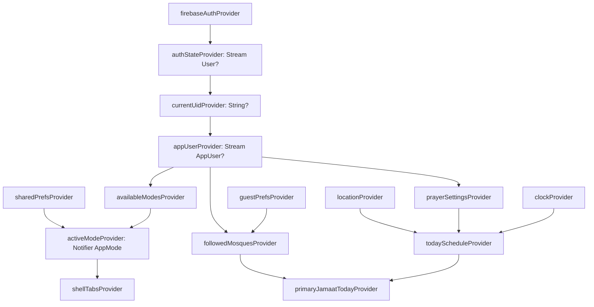

# 04 — State Management (Riverpod 3) & Models (freezed)

## 1. Decision summary

- **Riverpod 3**, **no code generation** for providers (D-080).
- Use only these provider kinds in new code:

| Need | Use |
|------|-----|
| A dependency (repository, service, Firebase instance) | `Provider` |
| Read-only live data from Firestore | `StreamProvider` (with `.family` for ids) |
| One-shot async value (e.g. geocoding a city) | `FutureProvider` |
| State that changes by user action (sync) | `NotifierProvider` + `Notifier` |
| State that loads async **and** has actions | `AsyncNotifierProvider` + `AsyncNotifier` |
| Live stream **and** actions on it | `StreamNotifierProvider` + `StreamNotifier` |

- `StateNotifier`, `StateNotifierProvider`, `StateProvider` and `ChangeNotifierProvider` are
  **legacy** in Riverpod 3 (moved to `package:flutter_riverpod/legacy.dart`). **No new code uses
  them.** Existing ones are migrated feature by feature (§8).

## 2. Rules every developer must follow

1. **Widgets are dumb.** A widget reads state (`ref.watch`) and calls controller methods
   (`ref.read(x.notifier).doThing()`). No Firestore calls, no business rules, no date math in widgets.
2. `ref.watch` only in `build` methods (widget or provider). `ref.read` only inside callbacks.
   Never `ref.read` in `build`.
3. `ref.listen` for side effects (snackbars, navigation, dialogs) — never do them inside `build`.
4. After every `await` inside a Notifier, check `if (!ref.mounted) return;` before touching `state`.
5. Screen-scoped state uses **`.autoDispose`**. App-wide state (auth, active mode, user doc,
   settings) does **not**.
6. Parameters go through `.family` (e.g. `mosqueProvider(mosqueId)`), never through a global
   "selected id" provider. (Existing `StateProvider` "selected child/class" providers are replaced by
   route parameters + family providers.)
7. Always handle all 3 `AsyncValue` states. Use the shared widget `AsyncView(value, data: …)` that
   shows a skeleton for loading and `ErrorView` with retry for error.
8. Keep providers **small and derived**. Example: `todayScheduleProvider` watches
   `prayerSettingsProvider` + `locationProvider` + `clockProvider`. Don't build one giant "home state".
9. A provider that depends on the signed-in user **must** watch `currentUidProvider`. When the user
   signs out, it rebuilds and closes old streams. This stops data leaking between accounts.
10. Mutations are **optimistic** where the UI must feel instant (prayer marking). Otherwise show a
    loading state on the button only.

## 3. Global provider graph



## 4. Provider catalog (the names to use)

### Core
```dart
final firebaseAuthProvider = Provider((ref) => FirebaseAuth.instance);
final firestoreProvider    = Provider((ref) => FirebaseFirestore.instance);
final functionsProvider    = Provider((ref) => FirebaseFunctions.instanceFor(region: 'asia-south1'));
final storageProvider      = Provider((ref) => FirebaseStorage.instance);
final sharedPrefsProvider  = Provider<SharedPreferences>((ref) => throw UnimplementedError()); // overridden in main
final clockProvider        = Provider<Clock>((ref) => const SystemClock());
final isOnlineProvider     = StreamProvider<bool>(...);
```

### Auth & user
```dart
final authStateProvider   = StreamProvider<User?>((ref) => ref.watch(firebaseAuthProvider).userChanges());
final currentUidProvider  = Provider<String?>((ref) => ref.watch(authStateProvider).value?.uid);
final appUserProvider     = StreamProvider<AppUser?>((ref) {
  final uid = ref.watch(currentUidProvider);
  if (uid == null) return Stream.value(null);
  return ref.watch(userRepositoryProvider).watch(uid);
});
final authControllerProvider = AsyncNotifierProvider.autoDispose<AuthController, void>(AuthController.new);
```

### Modes (05 §4)
```dart
enum AppMode { individual, parent, organization, masjidAdmin }

final availableModesProvider = Provider<Set<AppMode>>((ref) {
  final u = ref.watch(appUserProvider).value;
  if (u == null) return const {};
  return {
    AppMode.individual,
    if (u.modes.parent.childCount > 0) AppMode.parent,
    if (u.modes.org != null) AppMode.organization,
    if (u.modes.masjidAdminOf.isNotEmpty) AppMode.masjidAdmin,
  };
});

class ActiveModeNotifier extends Notifier<AppMode> {
  @override
  AppMode build() {
    final available = ref.watch(availableModesProvider);
    final saved = AppMode.values.asNameMap()[ref.read(sharedPrefsProvider).getString('jz_active_mode_v1')]
        ?? ref.read(appUserProvider).value?.lastMode
        ?? AppMode.individual;
    return available.contains(saved) ? saved : AppMode.individual;   // fall back if a mode was lost
  }

  Future<void> switchTo(AppMode mode) async {
    if (!ref.read(availableModesProvider).contains(mode)) return;
    state = mode;
    await ref.read(sharedPrefsProvider).setString('jz_active_mode_v1', mode.name);
    await ref.read(userRepositoryProvider).setLastMode(ref.read(currentUidProvider)!, mode); // fire & forget ok
    ref.read(analyticsProvider).modeSwitched(mode);
  }
}
final activeModeProvider = NotifierProvider<ActiveModeNotifier, AppMode>(ActiveModeNotifier.new);
```

### Feature providers (examples; each feature file lists its own)
| Provider | Kind | Key |
|----------|------|-----|
| `todayScheduleProvider` | `Provider<PrayerSchedule?>` | — |
| `fardLogsForDayProvider` | `StreamProvider.family<Map<PrayerName, PrayerLog>, (SubjectRef, String dateKey)>` | subject + day |
| `prayerMarkControllerProvider` | `NotifierProvider.family<…, SubjectRef>` | subject |
| `dailySummariesProvider` | `StreamProvider.family<List<DailySummary>, (SubjectRef, String monthKey)>` | subject + month |
| `streakProvider` | `StreamProvider.family<Streak, SubjectRef>` | subject |
| `qazaCountersProvider` | `StreamProvider.family<QazaCounters, SubjectRef>` | subject |
| `childrenProvider` | `StreamProvider<List<Child>>` | current uid |
| `mosqueProvider` | `StreamProvider.family<Mosque?, String>` | mosqueId |
| `nearbyMosquesProvider` | `StreamProvider.autoDispose.family<List<MosqueHit>, NearbyQuery>` | center + radius |
| `mosqueSearchProvider` | `FutureProvider.autoDispose.family<List<Mosque>, String>` | query (debounced 300 ms in the controller) |
| `followedMosquesProvider` | `NotifierProvider<FollowedMosquesNotifier, FollowState>` | merges guest prefs + user doc |
| `jamaatEditorControllerProvider` | `NotifierProvider.autoDispose.family<…, String>` | mosqueId (draft until Publish) |
| `orgProvider`, `classesProvider`, `studentsByClassProvider` | `StreamProvider(.family)` | orgId / classId |
| `reportCardControllerProvider` | `AsyncNotifierProvider.autoDispose.family` | class/student + period |

`SubjectRef` is a small freezed union: `SubjectRef.self(uid) | .child(childId) | .student(studentId)`.
Its `collectionPath` getter returns `users/{uid}`, `children/{id}` or `students/{id}`. **Every**
prayer/streak/qaza provider takes a `SubjectRef`, so Individual, Parent and Teacher screens share one
implementation (today's code already does this idea with `personFardLogsProvider(uid)`).

## 5. Controller example (optimistic prayer marking)

```dart
class PrayerMarkController extends Notifier<Map<String, PrayerStatus?>> {
  PrayerMarkController(this.subject);           // Riverpod 3 family: arg via constructor
  final SubjectRef subject;

  @override
  Map<String, PrayerStatus?> build() => {};     // pending optimistic marks, keyed by logId

  Future<void> mark(String dateKey, PrayerName p, PrayerType t, PrayerStatus? status) async {
    final id = PrayerLog.idFor(dateKey, p, t);
    state = {...state, id: status};             // UI shows this immediately
    try {
      await ref.read(prayerRepositoryProvider).setStatus(subject, dateKey, p, t, status);
      // Firestore resolves locally at once (offline cache), so this await is fast even offline.
    } catch (e, st) {
      if (!ref.mounted) return;
      state = {...state}..remove(id);           // roll back
      ref.read(errorReporterProvider).report(e, st);
      rethrow;                                  // widget's ref.listen shows the snackbar
    }
    if (!ref.mounted) return;
    state = {...state}..remove(id);             // stream now has the real value
  }
}
final prayerMarkControllerProvider =
    NotifierProvider.family<PrayerMarkController, Map<String, PrayerStatus?>, SubjectRef>(
        PrayerMarkController.new);
```

## 6. Models with freezed (D-081)

- All Firestore-backed models live in `packages/jaiza_core/lib/src/models/` (or in the feature's
  `domain/` for app-only models) and use freezed 3 syntax:

```dart
@freezed
abstract class Child with _$Child {
  const factory Child({
    required String id,
    required String name,
    int? birthYear,
    ChildGender? gender,
    @Default(<String>[]) List<String> guardianUids,
    @Default(<String>[]) List<String> linkedStudentIds,
    DateTime? trackingSince,
    DateTime? createdAt,
    DateTime? updatedAt,
  }) = _Child;

  factory Child.fromJson(Map<String, dynamic> json) => _$ChildFromJson(json);
}

@Freezed(unionKey: 'type')
sealed class JamaatRule with _$JamaatRule {
  const factory JamaatRule.fixed({required String time}) = FixedJamaat;          // "05:15"
  const factory JamaatRule.afterAzan({required int offsetMinutes}) = AfterAzanJamaat;
  factory JamaatRule.fromJson(Map<String, dynamic> json) => _$JamaatRuleFromJson(json);
}
```

- **Firestore conversion** happens in one place per app, `lib/core/firestore/converters.dart`:
  - `Timestamp ↔ DateTime` — `@TimestampConverter()` in the app; in `jaiza_core` models, dates are
    `DateTime`, and the repository runs `FirestoreJson.decode(snap.data())`. That helper turns every
    `Timestamp` into an ISO string and every `GeoPoint` into `{lat, lng}` before calling `fromJson`.
    `FirestoreJson.encode()` does the reverse on writes and replaces sentinel fields (`createdAt`/
    `updatedAt`) with `FieldValue.serverTimestamp()`.
  - Use `withConverter<T>()` on collection references so repositories get typed snapshots.
- **Unknown enum values** MUST NOT crash old app versions: use
  `@JsonKey(unknownEnumValue: JsonKey.nullForUndefinedEnumValue)` on every enum field.
- **Missing fields** always have defaults (`@Default`) so old documents still parse.
- `build_runner` command (root): `dart run build_runner build --delete-conflicting-outputs`.
  Generated `*.freezed.dart` / `*.g.dart` files **are committed** (so CI and new devs don't need to
  generate before running).

## 7. Local (device-only) state

Device-only prefs stay in `SharedPreferences` behind small `Notifier`s in `core/local/`:
theme, onboarding done, active mode cache, guest mosque prefs, notification permission asked, last
tab, class/family reminder toggles (D-045, D-033). The current `StringPref/SetPref/BoolPref/IntPref`
helpers are rewritten as generic `Notifier`s:

```dart
class BoolPrefNotifier extends Notifier<bool> {
  BoolPrefNotifier(this.key, this.fallback);
  final String key; final bool fallback;
  @override bool build() => ref.watch(sharedPrefsProvider).getBool(key) ?? fallback;
  Future<void> set(bool v) async { state = v; await ref.read(sharedPrefsProvider).setBool(key, v); }
}
final themeFollowSystemProvider = NotifierProvider<BoolPrefNotifier, bool>(() => BoolPrefNotifier('jz_x', true));
```

Anything that D-073 says must **sync** moves from these prefs to `users/{uid}` (06 §2.1). For a
**guest**, the same providers read from prefs. The `followedMosquesProvider` hides the difference:
it reads prefs when `currentUidProvider == null` and the user doc otherwise.

## 8. Migration from Riverpod 2 (gradual)

1. Bump `flutter_riverpod` to 3.x. Change imports of `StateNotifier*` / `StateProvider` to
   `package:flutter_riverpod/legacy.dart` so the app compiles unchanged.
2. Fix breaking API changes across the code base:
   - `AsyncValue.valueOrNull` → `.value` (in v3 `.value` returns `null` while loading/error).
   - Errors thrown in providers now arrive wrapped (`ProviderException`); `ErrorMapper` must unwrap.
   - Providers retry automatically on error by default. Set
     `ProviderScope(retry: (count, error) => count < 3 ? Duration(seconds: 1 << count) : null)`, and
     turn retry off for permission errors (`permission-denied` should not retry).
   - Providers pause while their widgets aren't visible. Streams resume on return — no action
     needed, but don't rely on background listeners for notifications.
3. Migrate **one feature per PR**, in this order: `core/local` prefs → mosques → prayers/today →
   qaza → family → organization → settings. Each PR removes its legacy imports.
4. When `grep -r "legacy.dart" lib` is empty, add a lint check in CI so they never come back.

## 9. Testing state

- Unit test Notifiers with `ProviderContainer.test(overrides: [...])` and fake repositories.
- Redirect logic is a pure function `redirect(RouterInputs)` — test every row of the 05 §6 table.
- Golden/widget tests for Today, Mode chooser, Mosque detail in **en + ur** and text scale 1.0/1.5.
