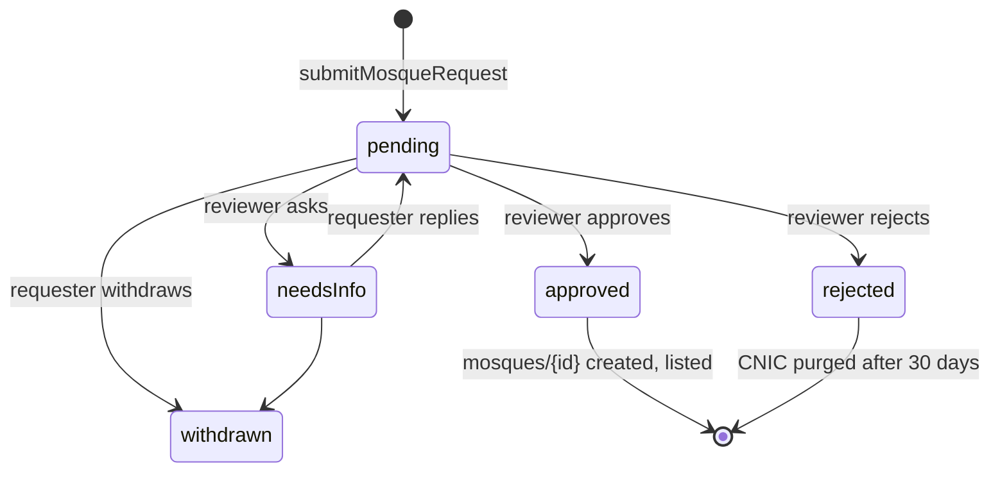

# 10 — Mosques & Jama'at Times

Replaces the demo data in `features/mosques/data/mosque_data.dart` (`kDemoMosques`) and the
device-only prefs in `core/local/local_prefs.dart` (primary/saved mosques, alerts).

## 1. Actors

| Actor | Can |
|-------|-----|
| Guest | Search, nearby, view, save (device), local reminders, change alerts (mobile) |
| Signed-in user | + request a mosque, claim admin, report a wrong time, synced follows |
| Masjid admin (≤ 3 per mosque) | Edit timetable, schedule changes, Jumu'ah, phone, photo, handle reports |
| Primary admin | + invite/remove the other admins |
| Platform reviewer | Approve/reject requests, reveal CNIC (audited), edit/suspend mosques, assign admins |

## 2. Lifecycle


A listed mosque can later be **suspended** (`listed:false`) by a reviewer (fake data, abuse).

## 3. Register a mosque (F-92)

The current `register_mosque_screen.dart` has 3 steps. It keeps the same UI with real data behind it.

### 3.1 Step 0 — duplicate check (exists as "Is this the same mosque?")
- After the user drops the pin, query listed mosques within **150 m** (geohash) and show any with a
  similar name. Similar = normalized names (lowercase; remove "masjid", "jamia", "مسجد", punctuation)
  with Levenshtein ≤ 3, or one contains the other.
- "Yes, that's it" → go to **claim admin** for that mosque (§5), or "report" if they only wanted to
  fix times.
- "No, it's different" → continue. The request stores `possibleDuplicateIds` for the reviewer.

### 3.2 Step 1 — Mosque details
Name (required, 3–80), name in Urdu (optional), address (required), area, city (from the PK cities
list), province (auto from city), **pin on map** (required; "Use my location" or drag the pin — until
the map ships, show lat/lng from GPS + reverse geocoded address with the `geocoding` package), fiqh,
phone (optional, public), 1–3 photos (optional).

### 3.3 Step 2 — About you + proof
Your role at the mosque (imam / khateeb / muezzin / committee / other), your name (pre-filled), your
phone (pre-filled from the account or asked; +92), **CNIC** (`#####-#######-#`, checked with the
regex `^\d{5}-\d{7}-\d$`), proof documents (1–3, image or PDF, ≤ 5 MB each: letter from the
committee on letterhead, utility bill in the mosque's name, or similar), and a checkbox:
*"I agree that Al Islaah may use my CNIC and documents only to verify this mosque. They are stored
encrypted and deleted if the request is rejected."* (Link to the privacy policy.)

### 3.4 Step 3 — Review & submit
Summary + optional first Jama'at timetable (can be skipped; the admin can add it after approval).
Submit:
1. Client pre-generates `requestId = firestore.collection('mosqueRequests').doc().id`.
2. Upload proofs/photos to `mosqueRequests/{uid}/{requestId}/…` (07 §3). Show progress per file.
3. Call `submitMosqueRequest({requestId, proposed, requester, cnic, proofPaths, photoPaths, jamaat?})`.
4. Success screen (exists) + "Track your request" → `/app/mosque-requests/{requestId}`.

If step 3 fails after uploads, retry with the same `requestId` (the function is idempotent on it).
Orphan uploads with no request are deleted by a weekly maintenance job.

## 4. CNIC encryption (D-052) — how it works

**Goal:** the CNIC number is readable only by an authorised reviewer who clicks "Reveal", and every
reveal is logged. A database leak, a Firestore export or a developer browsing the console shows
only unreadable text.

**Parts**
- **Cloud KMS** key ring `jaiza` in `asia-south1`, symmetric key `cnic` (AES-256, Google-managed HSM
  or software; automatic rotation every 365 days).
- IAM: only the Functions runtime service account gets `roles/cloudkms.cryptoKeyEncrypterDecrypter`
  on that key. **No human** gets that role (not even the owner account — they'd use the dashboard like
  everyone else).
- A secret `CNIC_HMAC_KEY` (Secret Manager) to make a **searchable fingerprint** without storing the
  number (to spot the same CNIC across many requests).

**Encrypt (in `submitMosqueRequest`)**
```ts
import { KeyManagementServiceClient } from '@google-cloud/kms';
const kms = new KeyManagementServiceClient();
const KEY = kms.cryptoKeyPath(PROJECT, 'asia-south1', 'jaiza', 'cnic');

const digits = cnic.replace(/-/g, '');                      // 13 digits
const [enc] = await kms.encrypt({
  name: KEY,
  plaintext: Buffer.from(digits),
  additionalAuthenticatedData: Buffer.from(requestId),      // ciphertext only valid for this request
});
const hmac = createHmac('sha256', CNIC_HMAC_KEY.value()).update(digits).digest('hex');

await db.doc(`mosqueRequestsPrivate/${requestId}`).set({
  cnicCiphertext: Buffer.from(enc.ciphertext as Uint8Array).toString('base64'),
  cnicKeyVersion: enc.name,                                 // which key version encrypted it
  cnicHmac: hmac,
  createdAt: FieldValue.serverTimestamp(),
});
// public request doc gets only: cnicLast4: digits.slice(-4)
```
**Decrypt (in `revealCnic`, reviewers only)**
```ts
const [dec] = await kms.decrypt({
  name: KEY,
  ciphertext: Buffer.from(priv.cnicCiphertext, 'base64'),
  additionalAuthenticatedData: Buffer.from(requestId),
});
await audit(req.auth.uid, 'revealCnic', requestId);
return { cnic: format(dec.plaintext.toString()) };          // "35202-1234567-1"; shown for 30 s in the dashboard, never cached
```
**Retention**: kept while the request is approved and the requester is an admin (the owner's choice, so
there's evidence if a dispute happens). Deleted 30 days after rejection, 7 days after withdrawal, and
immediately on account deletion. If the admin is removed from the mosque, deleted after 90 days.
**Cost**: KMS charges a small monthly fee per key version plus a tiny fee per 10,000 operations — a
few cents a month at our volume. **Legal**: tell users in the privacy policy why the CNIC is
collected, how long it's kept, and who can see it. Get the policy text reviewed before launch.

## 5. Claim admin of an existing mosque (F-93)
- Mosque detail → "Are you from this mosque's management?" → same steps 2–3 with `kind: 'claimAdmin'`.
- If the mosque already has 3 admins, the button says "Contact the mosque's admins" (a report with
  category "admin request" goes to the primary admin).
- The reviewer sees the claim with the current admins listed; approval adds the requester.

## 6. Jama'at timetable (D-054 … D-056, D-060)

### 6.1 Model (see 06 §2.10)
```dart
sealed JamaatRule = fixed(time: 'HH:mm') | afterAzan(offsetMinutes: 0..60)
Map<PrayerName, JamaatRule> jamaat           // fajr..isha, any may be missing = "not set"
List<JumuahSlot> jumuah                      // 0..3, each {time, label?}
List<ScheduledChange> upcoming               // 0..10, sorted by effectiveFrom
```

### 6.2 Effective schedule for a date (shared logic in `jaiza_core` and `functions/src/lib/jamaat.ts`)
```dart
Map<PrayerName, JamaatRule> rulesOn(Mosque m, String dateKey) {
  final rules = {...m.jamaat};
  for (final c in m.upcoming.sortedBy((c) => c.effectiveFrom)) {
    if (c.effectiveFrom.compareTo(dateKey) <= 0) rules.addAll(c.jamaat);   // later changes win
  }
  return rules;
}

DateTime? jamaatTime(Mosque m, PrayerName p, DateTime day) {
  final r = rulesOn(m, dateKey(day, m.timezone))[p];
  return switch (r) {
    FixedJamaat(:final time)          => atLocal(day, time, m.timezone),
    AfterAzanJamaat(:final offsetMinutes) =>
        azanFor(m.location, m.calcMethod, m.madhab, day, p).add(Duration(minutes: offsetMinutes)),
    null => null,
  };
}
```
- "After azan" times **change every day** — they are calculated, never stored.
- Because `upcoming` is applied on the client too, the app shows the right time **even before** the
  nightly `applyDueJamaatChanges` job runs, and even offline.
- Friday: the **Zuhr** row shows the Jumu'ah slots instead (if any are set).

### 6.3 Admin editing UX (Masjid Admin mode → My Masjid → Timetable)
- One row per prayer: a segmented control **Fixed time / After azan**; a time picker (fixed) or a
  stepper 0–60 min (after azan). Next to it, "Today: 5:15 AM", calculated live.
- Warnings (not blocking): a fixed time **before** today's azan for that prayer, or **after** the
  window ends; Maghrib fixed time (usually wrong, since Maghrib moves every day).
- Jumu'ah section: add up to 3 slots (time + optional label, e.g. "Urdu bayan 1:00").
- **"Apply from"**: *Today (now)* or *a date* (date picker, tomorrow … +180 days).
  - Today → the edits change `jamaat` directly.
  - A date → the edits are saved as a `ScheduledChange` in `upcoming` (only the prayers that changed).
- The editor keeps a **draft** (in `jamaatEditorControllerProvider`) and shows a diff:
  "Fajr 05:15 → 05:30 from Mon 3 Nov". Nothing is saved until **Publish**.
- Publish = one `update()` with `jamaatVersion + 1`, `jamaatUpdatedAt: serverTimestamp()`,
  `jamaatUpdatedBy: uid` (the rules require all 3). One publish → one push (D-060).
- "Upcoming changes" list: each change can be edited or cancelled (cancel = remove it from
  `upcoming` + publish).
- History tab: the last 20 `jamaatHistory` entries.

### 6.4 What followers see
- Mosque detail: the timetable for today, and a banner for the next scheduled change ("From Mon
  3 Nov: Fajr 5:30").
- Today screen (primary mosque): the Jama'at time under each prayer, and "Jama'at in 12 min" on the
  current prayer card.
- "Last updated 3 days ago by the mosque" (trust signal). If `jamaatUpdatedAt` > 60 days ago:
  "Times may be out of date".

## 7. Following, reminders, alerts
| Action | Signed in | Guest |
|--------|-----------|-------|
| Save / unsave | `users.mosques.savedIds` (max 20) | prefs |
| Set primary | `users.mosques.primaryId` (must also be saved) | prefs |
| "X min before Jama'at" reminders | `users.mosques.alerts` → local schedule (13 §3) | prefs → local |
| Change alerts (push) | subscribe topic `mosque_{id}` on save; unsubscribe on unsave | same (mobile only) |

The link-mosque step after verification (`link_mosque_screen.dart`) stays: pick a primary mosque, or
skip.

## 8. Search

### 8.1 Nearby (geohash)
```dart
final ref = GeoCollectionReference(FirebaseFirestore.instance.collection('mosques'));
ref.subscribeWithin(
  center: GeoFirePoint(GeoPoint(lat, lng)),
  radiusInKm: radius,                        // 5 default; 10/25 options
  field: 'geo',
  geopointFrom: (d) => (d['geo'] as Map)['geopoint'] as GeoPoint,
  queryBuilder: (q) => q.where('listed', isEqualTo: true),
  strictMode: true,                          // drop results outside the circle
);
```
Sort by distance on the client; show the distance ("850 m"). Cap to the nearest 50.

### 8.2 By name / city
- `searchKeywords` (written by Functions): for each word of the name (normalized, en + ur) and the
  city, every prefix of length 2–10. Stop words ("masjid", "jamia", "mosque", "مسجد") are skipped.
  Example: "Jamia Masjid Al-Noor, Lahore" → words `alnoor`, `noor`, `lahore` →
  `al, aln, alno, alnoo, alnoor, no, noo, noor, la, lah, laho, lahor, lahore`.
- Query: `where('listed', ==, true).where('searchKeywords', arrayContains: firstWordOfQuery).limit(30)`,
  then filter the other words on the client.
- City filter chip: `where('city', ==, city)`.
- When the mosque count grows past ~20,000, or fuzzy search is needed, switch to the **Typesense** or
  **Algolia** Firebase extension. The UI doesn't change (search goes behind `MosqueSearchRepository`).

### 8.3 Maps & Mapbox (D-057)
- **Yes, a paid Mapbox key works** for this feature. Use it for: (1) the map view of nearby mosques,
  (2) the pin-drop map in registration, (3) address search/geocoding in registration (Mapbox
  Geocoding API).
- The **nearby query itself stays in Firestore** (free, works offline from cache). Mapbox is only for
  drawing and geocoding.
- Package: `flutter_map` with Mapbox **raster or vector tiles** — one code path for Android, iOS and
  web. (The official `mapbox_maps_flutter` SDK has no web support.)
- Token: a **public** token (`pk.…`) with URL restrictions (web domain) and only the scopes needed.
  Put it in `--dart-define=MAPBOX_TOKEN=…` at build time, not in git. Show the Mapbox attribution
  (required by their terms).
- "Open in Google Maps / Apple Maps" for directions: `url_launcher` with a `geo:` / maps URL — free.

## 9. Reports ("time is wrong", F-95, D-058)
- Mosque detail → "Report a problem" → pick a prayer (or "general"), write up to 300 chars.
- One report per user per mosque per day (doc id `{uid}_{dateKey}`).
- Admins get a push and see an inbox with open reports; they can **Resolve** (optionally with a new
  publish) or **Dismiss**. The reporter sees the status in "My reports" (More → Mosques).
- Reports open for > 7 days are escalated to the dashboard (`escalateReports`).

## 10. Masjid Admin mode screens
| Screen | Content |
|--------|---------|
| My Masjid (home) | Mosque card, today's timetable, next scheduled change, follower count, open reports badge, "Edit timetable" |
| Timetable editor | §6.3 |
| Reports | Inbox (open / resolved) |
| Admins | List (primary marked), invite by email (primary only, max 3 total), remove, leave |
| Mosque info | Phone, photo. "Request a change of name/address/location" → `mosqueRequests` `kind: 'editInfo'` |
| If admin of several mosques (max 5) | A mosque picker at the top |
