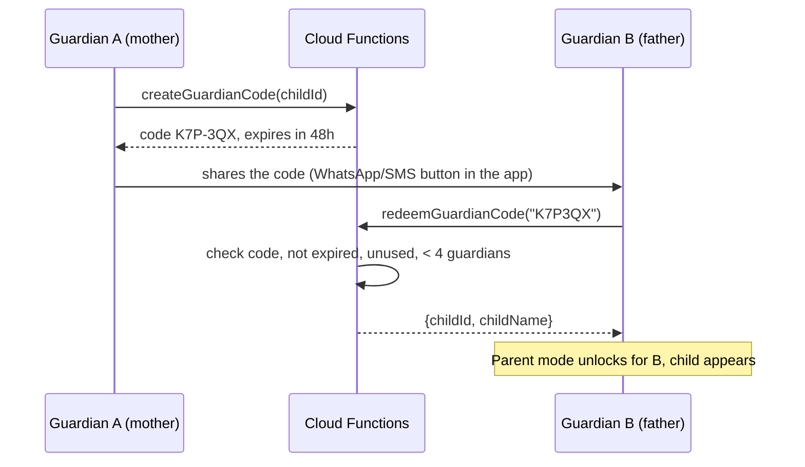
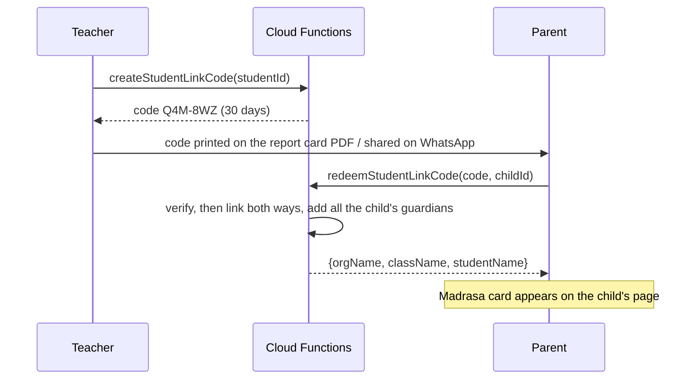

# 11 — Parent Mode

## 1. Summary
A parent (guardian) tracks children who don't have phones (D-030). A child can have up to 4 guardians
(D-031). Parents can link a child to their madrasa student record to see madrasa attendance
read-only (D-034).

## 2. Setup (`/app/family/setup`)
Two choices:
1. **Add a child** → form: name (required), age (0–25, optional), gender (boy/girl, optional).
   Write:
   ```dart
   children.doc().set({
     'name': name, 'birthYear': age == null ? null : DateTime.now().year - age,
     'gender': gender, 'guardianUids': [uid], 'createdBy': uid,
     'trackingSince': todayKey, 'createdAt': serverTimestamp(), 'updatedAt': serverTimestamp(),
   });
   ```
   The `onChildCreated` trigger updates `users.modes.parent.childCount` → Parent mode unlocks.
2. **Join with a code** (the other parent already added the child) → enter `K7P-3QX` →
   `redeemGuardianCode` → the child appears.

Age shown in the UI = `currentYear − birthYear` ("about 9 years"). Move the device-only
`ChildExtrasNotifier` data (`jz_child_extras_v1`) to Firestore once on upgrade, then delete the key.

## 3. Family home (Parent mode "Family" tab)
- A child switcher (chips/avatars). The chosen child is a **route parameter**
  (`/app/family/:childId`), not a global selected-child provider.
- For the chosen child: today's 5 Fard rows (same widget as Individual, with `SubjectRef.child`),
  Nawafil card, Qaza card, streak, "Needs attention" dot (§6).
- Each Fard row shows who marked it ("Marked by Ammi · 5:20 PM") when there are 2+ guardians.
- If the child is linked to a madrasa: a **Madrasa** card "Jamia Ashrafia · Class Hifz-2 ·
  Today: Zuhr ✓ Asr ✓" (read-only, from `students/{sid}/prayers`).

## 4. Co-parents (guardians) — how the invite code works

- Screen `/app/family/:childId/guardians`: the list of guardians (name, "added on"), "Invite another
  parent" (shows the code, a copy button and a **Share** button with a ready message in en/ur:
  "Join me in tracking Ahmed's prayers on Jaiza. Code: K7P-3QX (valid 48 hours). Download: <link>").
- The creator (`createdBy`) can remove other guardians. Anyone can leave. The last guardian can't
  leave; they can only delete the child.
- Codes are **single use**, valid 48 h. Creating a new code doesn't cancel older ones (up to 5
  active).
- Security: codes are made on the server from a 31-character alphabet (≈ 887 million combinations),
  and redeem attempts are rate-limited (10 failures/hour/user), so guessing is not practical.
- If both parents added the **same child separately** before linking: v1 has no merge. They delete
  one copy. (A "merge children" tool is a later idea.)

## 5. Linking a child to their madrasa (D-034) — the full solution

**Problem:** the teacher marks a *student* (`students/{sid}`, owned by the org). The parent tracks a
*child* (`children/{cid}`, owned by the family). They are different records made by different
people. We need a safe, consent-based link so the parent can **read** the student's attendance.

**Solution: a student link code, made by the teacher, given to the parent.**



Step by step:
1. **Teacher side** — Student detail → "Parent access" → *Create parent code*. This works only if the
   org admin has **Allow parents to link** on (`organizations.allowParentLinking`, default on). The code
   is shown with Share/Copy buttons. It is also printed at the bottom of that student's **report
   card PDF** (12 §7) if it's still valid, so a teacher can hand out report cards and codes together.
2. **Parent side** — Child page → "Link madrasa" → enter the code → confirm screen: "Link *Ahmed*
   with *Ahmed Raza, Class Hifz-2, Jamia Ashrafia*?" → Link.
3. **Server** (`redeemStudentLinkCode`, in one transaction):
   - `students/{sid}.guardianUids` ∪= all guardians of the child (max 4).
   - `students/{sid}.linkedChildIds` ∪= `childId`; `children/{cid}.linkedStudentIds` ∪= `sid`.
   - Mark the code used.
4. **Reading** — the parent's app reads `students/{sid}` and `students/{sid}/prayers` and
   `/dailySummaries` (allowed by `canReadStudent`, 07). The org name and class name are copied onto the
   student doc (`orgName`, `className`, set by Functions) so the parent never needs org/class read
   access.
5. **What the parent sees**: the madrasa card on the child page, a "Madrasa" tab in the child's
   records (calendar from the student's daily summaries), and the monthly attendance %. Logs have
   `source: 'teacher'`. **Home and madrasa logs are not merged** — the same Zuhr can be "prayed at
   madrasa" and "not marked at home". The child's page shows both, clearly labelled.
6. **New guardian later**: when a co-parent joins the child (§4), `redeemGuardianCode` also adds
   them to `guardianUids` of every student in `linkedStudentIds`.
7. **Unlink**: parent (child page → Madrasa → Unlink) or teacher/admin (student → Parent access →
   remove). `unlinkStudent` removes every link both ways. Removing a guardian from a child also
   removes that guardian from the linked students.
8. **Student leaves the madrasa** (`active: false`): the link stays and history stays readable; the
   card shows "Left madrasa". **Student deleted**: links are removed.
9. **Privacy**: the parent sees **only their own child's** student record and logs. The teacher sees
   nothing from the family side (no home logs, no parent names except "linked by 2 parents").

## 6. "Needs attention" + Family reminders (D-033, local)
- A child "needs attention" when a Fard window **has ended** today and that prayer isn't marked
  (existing `childNeedsAttentionProvider` logic, kept).
- Reminders (Android/iOS; hidden on web). Settings on `/app/family/reminders`, stored on the device
  (existing `FamilyReminderPrefs`, `jz_family_reminders_v1`): on/off, which prayers, minutes before the
  window ends (default 20), which children, quiet hours.
- Scheduling: for each chosen child × prayer, a local notification at `windowEnd − minutes`:
  "Has Ahmed prayed Asr? Tap to mark." The tap opens `/app/family/{childId}?mark=asr`.
- When **any** guardian marks the prayer, the other guardians' scheduled reminder should not fire. Local
  notifications can't check the server at fire time, so: (a) each guardian's app cancels a reminder
  when it **sees** the mark in its Firestore stream (works when the app has been open/backgrounded
  recently); (b) v2 idea: a silent FCM push from a trigger to the other guardians to cancel. v1 accepts
  that a reminder can sometimes fire after the other parent already marked.
- These reminders are part of the notification budget (13 §3) at lower priority than the user's own.

## 7. Child Qaza
Same as Individual Qaza (09 §4) with `SubjectRef.child`. The estimate is usually 0 (children start
counting at puberty); the screen explains this and suggests leaving it empty until then.

## 8. Remove a child
Child page → ⋮ → Remove. If there are other guardians: "Leave (Ahmed stays for Abbu)" or, for the
creator, "Delete for everyone". The `removeChild` callable does the work.

## 9. Edge cases
| Case | Behaviour |
|------|-----------|
| Guardian deletes their account | Removed from `guardianUids`; the child stays for the others; if alone, the child is deleted (05 §8) |
| 5th guardian tries a code | `too-many-guardians` → "A child can have up to 4 parents/guardians" |
| Code expired / used | Friendly error + "Ask for a new code" |
| Parent enters a student code for the wrong child | Confirm screen shows both names; they can unlink later |
| Org turns off parent linking | Existing links stay; no new codes can be made. The admin can "Remove all parent links" in org settings (callable) |
| Child marked by two guardians at the same time | Last write wins (same doc id) |
